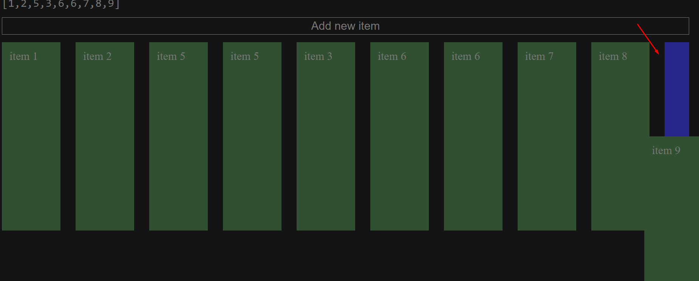
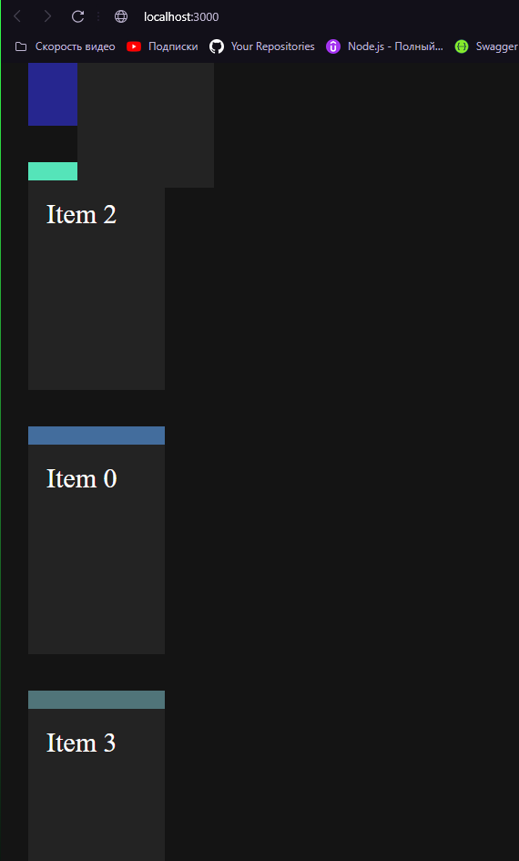

# react-ascension-dnd

## Все задачи:

---
### Реализовать:
- [x] первую версию DND с поиском узлов под курсором;
- [ ] если элемент выходит за пределы viewport, то производить скролл;
- [ ] чтобы элемент не мог выходить за рамки документа
- [ ] реализовать `Drag Cancel`
- [ ] `Drop` зоны;
- [ ] границу, при наведении на которую будет триггерится DND;
- [ ] перемещение выбранный элемент во время скрола, а не только во время перемещения мыши;
- [ ] скролл во время удерживания элемента курсором и его перемещение на мобильном устройстве;
- [ ] вторую версию DND с анимациями с использованием координат расположения
элементов и с использованием transform;
- [ ] возможность выбора версий DND;
---
### Пофиксить:
- [x] проекция не удаляется если мышь вышла за пределы документа
или пользователь открыл контекстное меню (реализовать `Drag Cancel`);
- [X] при горизонтальном положении `flex-direction: row` не сдвигаются крайние элементы;
- [ ] вешать на элементы, дата-атрибуты, а не классы. В `closest` искать по этому атрибуту;
- [ ] если 1 раз переместить элемент, сделать изменения в редакторе кода и не перезагружая страницу
   попробовать переместить элемент, то появляется несколько проекций. Возможно не происходит отписка от событий;
- [X] если появляется скролл и проксролить вниз, то во время перемещения элемента появляется отступ от элемента;
- [X] если не обнулить переменные `foundElement` и `elementToSwap` после предыдущего элемента и ещё раз на него нажать, то он
   будет меняться местом с соседним.
- [X] если в flex контейнере много элементов, то ширина элементов уменьшается чтобы они все вместились. При такой ситуации
проекция почему-то меньше чем сам элемент

- [X] если после скролла верхний элемент видно не полностью и пытаешься на его место поставить другой элемент, то начинает
прыгать скролл и моргать проекция

Решение:
  Если вы хотите предотвратить этот небольшой скролл вниз при 
добавлении элемента выше, вы можете сохранить текущую позицию прокрутки 
перед добавлением элемента и восстановить ее после добавления. 
Вот пример, как это можно сделать:
```JS
// Сохранить текущую позицию прокрутки
const scrollPosition = window.pageYOffset || document.documentElement.scrollTop || document.body.scrollTop;

// Создать и добавить новый элемент
const newElement = document.createElement('div');
document.body.insertBefore(newElement, document.body.firstChild);

// Восстановить позицию прокрутки
window.scrollTo(0, scrollPosition);
```